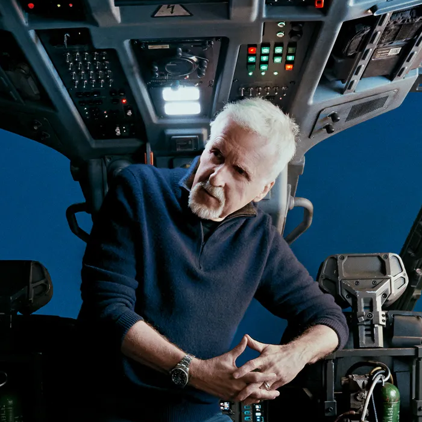

# James Cameron

<!--  -->

James Cameron’s journey began in the ordinary world of a truck driver, but his mind was always elsewhere—dedicated to tinkering, dreaming, and building things. As a child he devoured Jacques Cousteau documentaries, becoming fascinated with exploration and the deep ocean. From an early age he was drawn to difficult challenges; “hard is like a magnet” to him. He believed in the power of the individual and that fate could be engineered through work.

Cameron’s confidence often came before his achievements. Unable to afford USC’s celebrated film program, he built his own education instead. For six months he spent nights in the university library photocopying dissertations on optical printing and cinematography, creating a graduate-level education for a few hundred dollars. This act of self-direction launched him into film. He produced a short science-fiction film as proof of his ability, which earned him a job in Roger Corman’s B-movie studio. Within weeks he went from model builder to art director to second-unit director—his first proof that initiative could outrun credentials.

His first feature-length directing job ended abruptly when he was fired after five days. Broke and discouraged, he turned frustration into fuel, forcing discipline by writing screenplays in the most uncomfortable chair he could find so that he would finish faster. When opportunity returned, he allied with special-effects artist Stan Winston, sharing an obsession for craft and realism. Together they developed techniques that reshaped movie effects for decades. Cameron’s standards were famously high; he was known to operate cameras, adjust lighting, and edit himself, refusing to ask anyone to do work he wouldn’t do.

The central conflict of his life became the tension between filmmaker and explorer. That tension came into focus when NASA offered him a seat on the Space Shuttle. Though tempted, he declined, deciding he would only go to space on his own terms, following his plan even if it meant walking away from a dream. The decision proved fateful—the shuttle he refused was Columbia, later lost on re-entry. Cameron took it as a lesson that control and conviction mattered more than opportunity.

From that point forward, he pursued only self-defined challenges. His films—The Terminator, Aliens, The Abyss, Titanic, and Avatar—were built on ideas that often sat for decades until technology caught up. He demanded precision down to the smallest detail, from historically accurate stationery on Titanic to inventing new underwater cameras for Avatar: The Way of Water. His belief that confidence precedes ability became self-fulfilling; he made the impossible routine.

After conquering Hollywood, Cameron stepped away for eight years to explore the deep ocean. Diving to the Titanic and eventually to the bottom of the Mariana Trench, he merged his trade with his nature. “I’m an explorer by nature and a filmmaker by trade,” he said. His expeditions doubled as research and marketing, funding innovation while fueling storytelling. When he returned to filmmaking, he brought with him new tools—performance capture, underwater motion systems, and digital pipelines—that transformed how stories could be told. Cameron’s guiding principle remains that every idea is a work in progress, excellence is continuous, and mastery compounds for those who never quit.
