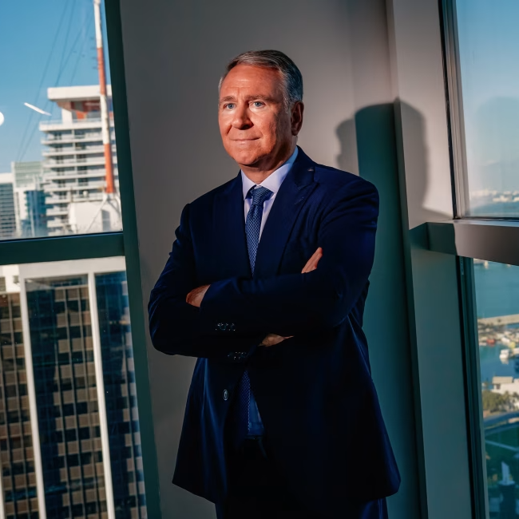

# Ken Griffin

<!--  -->

Ken Griffin’s interest in markets began early. In third grade, he wrote a school paper saying he wanted to learn how the stock market worked—a curiosity that never left him. As he later put it, “I’ve always been interested in the stock market for reasons I don’t fully understand. In third grade, I wrote a paper that I wanted to learn how the stock market works, and I’ve been on that journey now for almost 40 years.”

By college, he had combined that fascination with technical skills in mathematics, economics, and computer programming. At Harvard, while most students studied theory, he was building systems. He persuaded administrators to let him install a satellite dish on his dorm roof so he could receive real-time market data. From that dorm room, he began trading options and convertible bonds—an early experiment in quantitative investing. After graduating in 1989, he joined Frank Meyer’s Glenwood Partners in Chicago, managing roughly $1 million in seed capital. His returns were strong enough to launch his own firm, Citadel, in 1990.

Griffin’s early years in finance brought lessons in rejection and resilience. In 1994, while traveling to Switzerland to raise money for his young hedge fund, one investor walked out after realizing he wasn’t meeting John Griffin of Blue Ridge Capital. Another ended their meeting with the remark, “Such a bright young man—wrong career.” Griffin kept going. He later displayed a small plaque that read, If we’re going to eat, someone’s got to sell.

His appetite for information soon became legendary. When Enron filed for bankruptcy in December 2001, Griffin chartered a Gulfstream jet to Houston and brought a team of about sixteen Citadel employees with him. Over several days, they interviewed former Enron traders and analysts to understand how the company had operated and where its trading systems had failed. Citadel eventually hired Enron’s top quantitative research group and built a commodities business that went on to generate tens of billions of dollars in profits.

Adversity returned in 2008. During the global financial crisis, Citadel lost roughly half its equity in just sixteen weeks. Griffin later described those losses as “tuition,” calling them part of “the most expensive education in American history.” He credited the firm’s survival to lessons learned a decade earlier from the collapse of Long-Term Capital Management, whose former partners he had sought out to understand how a leveraged firm could survive after losing 90 percent of its equity.

Even within Citadel, Griffin prizes intellectual humility. He has told the story of a senior quantitative researcher who once said to him, “If you were good at math, this would be easier to explain.” Griffin took it in stride—a reflection of his belief that he should be surrounded by people who are better than him in their own fields.

In his view, Citadel’s endurance comes from research and constant adaptation. After visiting Saudi Aramco’s control center, he created something similar at Citadel’s Chicago headquarters: a 30-foot-long “risk wall” that visually displays the firm’s exposures and market data in real time. It reflects his conviction that information must be centralized, transparent, and constantly analyzed.

Over three decades, Citadel and its sister company, Citadel Securities, have become among the most influential firms in global finance. Griffin attributes that success to relentless learning and disciplined risk-taking. “Success is elusive,” he once said. “However high you climb, it’s probably twice as far.”

From the Harvard dorm room to the Enron interviews to the 2008 crisis and beyond, Griffin has treated every setback as a data point and every edge as something to be earned again. For him, the obsession never faded—the hunt never ends. Only the information changes.
