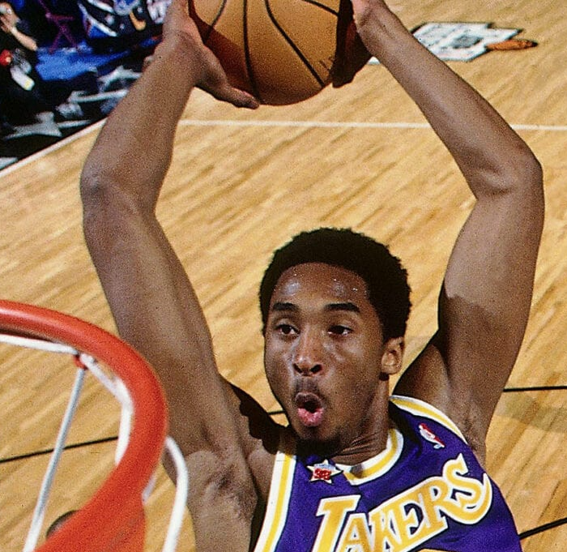

# Kobe Bryant

<!--  -->

Kobe Bryant’s quest began in childhood—an almost inhuman pursuit of greatness. Even at eight years old, he believed he would one day become one of the best to ever play the game. Growing up in Italy, where his father played professionally, gave him a different kind of foundation. While other kids chased flash and flair, Kobe obsessed over footwork, balance, and the geometry of the game. His self-belief was so intense it looked like delusion to others, but he carried it like armor—the dream of being the exception.

His early mentors were the greats he studied from afar. He filled a closet with VHS tapes of Magic Johnson, Larry Bird, and, most of all, Michael Jordan. He dissected every move, every pivot, every pause, treating game film like scripture. From that study he built his personal code: master the fundamentals, strengthen your weaknesses, and concentrate so deeply that the world falls away. At seventeen, he made the leap few dared to imagine—jumping straight from Lower Merion High School to the NBA. His parents had to co-sign his contract; the boy who had studied legends was now standing among them.

From the start, Kobe’s work ethic was volcanic. He practiced before sunrise, long after others had left, and carried that rhythm into the pros. His intensity forced teammates either to rise with him or move aside. Early on, he was benched, watching veterans take the minutes he craved. Instead of sulking, he turned the frustration into a private war. He created pressure on purpose—trash talk, public declarations, anything that raised the stakes. His standards were non-negotiable, and relationships that couldn’t survive that heat simply burned away. To Kobe, the game demanded everything—or it demanded nothing.

His crucible arrived early. In the 1997 playoffs against Utah, as the Lakers’ season hung in the balance, he shot four straight airballs—each one falling shorter, heavier than the last. The loss crushed him. That night he sat alone on the team plane, replaying every miss in his mind. Most players would’ve hidden from the memory; Kobe turned it into fuel. As soon as the season ended, he went straight back to work. He spent the summer in empty high-school gyms, lifting weights until his legs stopped trembling, rebuilding his lower body so fatigue would never steal his jump shot again. He’d rise before dawn, shoot until the lights buzzed overhead, run hill sprints in the heat, then return at night for more. That summer, he transformed himself from a teenager imitating men into a professional built to outlast them.

Years of obsessive repetition turned his craft into art. His footwork became ballet, his timing instinct. He trained his mind to stay stronger than emotion, creating rituals that removed distraction. He refused to have his sneakers pre-laced; he tied them himself before every game, a small act of control. When the moment came—when the shot clock dwindled and millions held their breath—he wasn’t thinking about failure or glory. He was simply there. At Michael Jordan’s urging, he began working with Tim Grover, the trainer who had forged Jordan’s body into armor. And alongside mindfulness coach George Mumford, he learned to marshal his thoughts like soldiers, to turn fear into focus. Together, they built a mind that didn’t flinch.

In time, Kobe evolved from a solitary assassin into a leader. He absorbed Jordan’s lessons on accountability and Tex Winter’s teachings on the Triangle offense, learning to channel his drive into something that elevated others. One moment captures it perfectly: during the Redeem Team’s camp in Las Vegas, his teammates stumbled in from a night out just as Kobe returned from a 4 a.m. workout, drenched in sweat. He didn’t say a word; he just set the standard.

He came to understand that legends aren’t defined by success, but by how they rise from failure. His ultimate gift—the Mamba Mentality—was his return to the world. Master the simple things relentlessly. Delete distractions. Create your own pressure. Let consistency compound. It was never meant as motivation for comfort. It was a blueprint for greatness.
