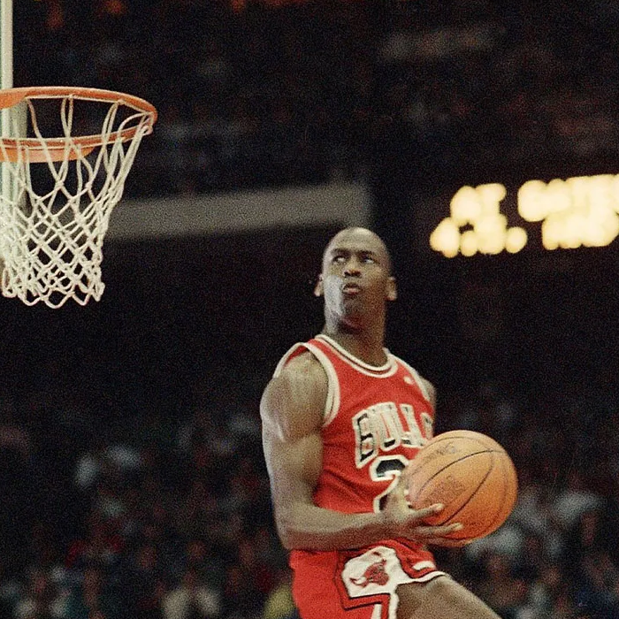

# Michael Jordan

Michael Jordan's journey began with a powerful slight: his high school varsity coach cut him from the team at age fifteen. The defeat hit him like a boulder; he went to his room and cried. But that pain became the nuclear fuel rods of his great fire. His father’s low expectations—suggesting Michael was too lazy for a real job—fueled him even more. From that moment, he had only one goal: to be a professional athlete.

After being cut, he made a list of the players who had taken the spots he believed he deserved. Every morning, when he trained, he thought about that list. It wasn’t about revenge—it was about proof. He wanted to show what could come from rejection. When he made varsity the next year, he attacked every practice as if he were still fighting to make the team.

Jordan’s trials were defined by an unrelenting devotion to practice. He lived by his high school coach’s mantra, “It’s hard, but it’s fair.” Every morning, Coach Herring picked him up for extra workouts before school. What others saw as hard work, Jordan experienced as play. He was a sponge, absorbing everything from his coaches and improving rapidly. He focused on the fundamentals, knowing that inconsistency meant compromise. He fought the limits of his own mind: it told him he couldn’t go further, that it hurt too much—but he pushed past it every time. His commitment was absolute.

When he stepped away from basketball to pursue baseball, he carried that same mindset into an entirely new arena. His trainer would arrive at the facility before dawn and find the batting cage lights already on. Jordan was there, alone, swinging until his hands split open and bled through the tape. Yet he never said a word about it. To him, the pain was simply part of the craft, another test of discipline.
His greatness rested on unwavering standards for himself and everyone around him. He demanded that his teammates match his intensity—his relentless pace, his precision, his hunger. If they couldn’t, he refused to lower his own bar. “We are not going to drop down to yours,” he told them. In his world, effort was non-negotiable. He competed in everything, no matter how small, always chasing a sharper edge.

His focus was total. Sometimes, before a game, he would invent motivation—imagining someone in the stands who had never seen him play before. That person became his purpose for the night. “Limits, like fears, are often just an illusion,” he said, and he proved it by performing as if every game were the first and last anyone would ever see.

He believed little things built the big things, demanding precision in every detail of his craft. After his final championship, he credited his mastery not only to his body but to his mind—a mind honed through discipline and forged in the pursuit of perfection.
